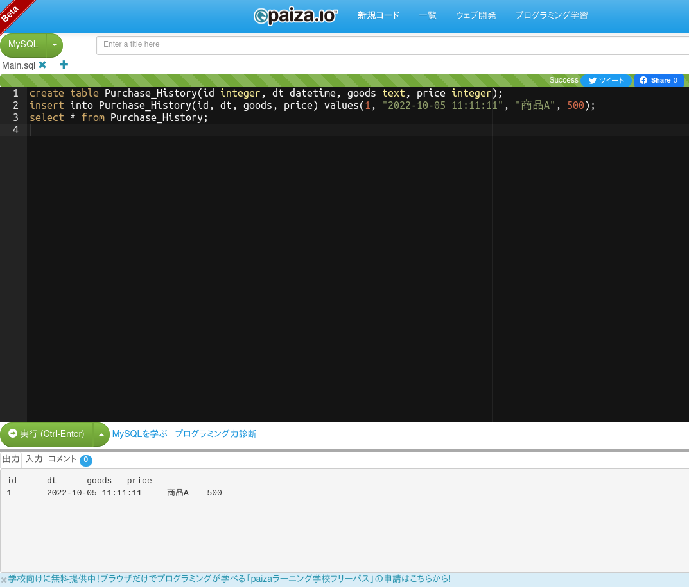

# Task1

## Task1-1

### ショッピングサイト

ログイン情報や、個人情報、購入履歴や閲覧履歴などの顧客に関する情報や、店舗情報や商品と価格などの出品者に関する情報をデータベースで管理している。

### 銀行

貯金額や取引記録のログなどがデータベースで管理されており、通帳を使わずにキャッシュカードで取引してもあとからすべての履歴が通帳に記載されるようになっている。

## Task1-2

ショッピングサイトの購入履歴のテーブルの一例。

