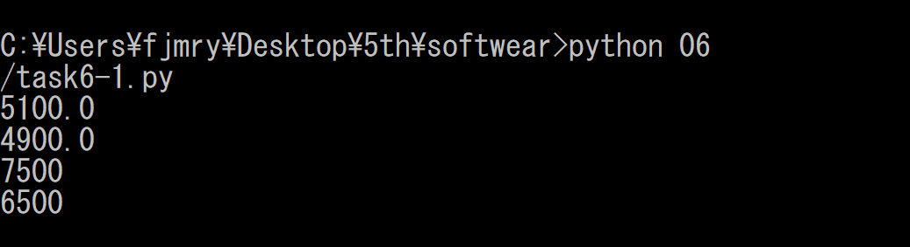
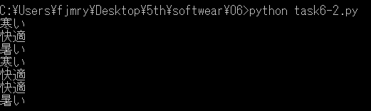

# Task6

## Task6-1

### ソースコード

```python
class Discount:
    def __init__(self, date, price):
        self.date = date 
        self.price = price

    def discount(self):
        if self.date=='Tue':
            self.price *= 0.7
        if self.price>=5000:
            self.price-=500
        print(self.price)


if __name__ == '__main__':
    tue1 = Discount('Tue', 8000)
    tue2 = Discount('Tue', 7000)
    thu1 = Discount('Thu', 8000)
    thu2 = Discount('Thu', 7000)
    tue1.discount()
    tue2.discount()
    thu1.discount()
    thu2.discount()

```

### 実行結果



## Task6-2

### テストケース一覧

| No | 室温 | 説明 |
|-|-|-|
|1| 20.3 | '寒い'を返す同値分割
|2| 24.2 | '快適'を返す同値分割
|3| 28.3 | '暑い'を返す同値分割
|4| 22.9 | '寒い'を返す上限の限界値分析
|5| 23.0 | '快適'を返す下限の限界値分析
|6| 24.9 | '快適'を返す上限の限界値分析
|7| 25.0 | '寒い'を返す下限の限界値分析

### 実行結果



### ソースコード

```python
class Message:
    def __init__(self, temperature):
        self.temperature = temperature

    def create_message(self):
        if self.temperature < 23.0:
            return '寒い'
        elif self.temperature < 25.0:
            return '快適'
        else:
            return '暑い'


if __name__ == '__main__':
    eq1 = Message(20.3)
    eq2 = Message(24.2)
    eq3 = Message(28.3)
    bdy1 = Message(22.9)
    bdy2 = Message(23.0)
    bdy3 = Message(24.9)
    bdy4 = Message(25.0)

    print(eq1.create_message())
    print(eq2.create_message())
    print(eq3.create_message())
    print(bdy1.create_message())
    print(bdy2.create_message())
    print(bdy3.create_message())
    print(bdy4.create_message())

```
