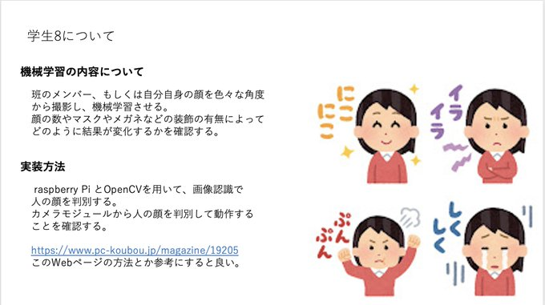

# Task-7

## 班員から出た意見と、それに対する感想

野添：27が一番良い。自分がHTMLを作ることを想定していたから。

自分は機械学習を作ることを想定していたので、そうなのかと思った。
自分的にはHTMLにはあまり興味がわかないので、低い得点を付けていた。

## 詳細化

学生8のスライドに対して詳細化。

### 概要

どのような手段で実現するのか、視覚的にわかりやすいような情報、１からは難しいと思うので、顔の数だけでなく、マスクやメガネの有無でどう変化するかを検証する。

### 資料例

