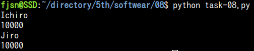

# Task08

## result



## code

```python:task-08.py
class Bank:
    def __init__(self, user, money):
        self.user = user
        self.__money = money

    def confirm(self):
        print(self.user)
        print(self.__money)

if __name__ == '__main__':
    user1 = Bank('Ichiro', 10000)
    user1.confirm()
    user1.user = 'Jiro'
    user1.__money = 20000
    user1.confirm()

```
