# Task10

## task10-1

### 作成したユースケース図

課題3-1で作成した空港の顧客管理システムのユースケース図。

### オブジェクト図

### 相手の反応

私と同じ内容のもののオブジェクト図を作成しているけど、結構違うんだなと思いました。
私のよりもくわしい情報が載っていてわかりやすいなと思いました。
 
野添

## task10-2

1. 多数
2. 0以上
3. 1以上
4. 1か5
5. 1か2か5
6. 0か1か9

## task10-3

### 分析クラス図

### シーケンス図

### 詳細クラス図

### 相手の反応

特にシーケンス図がいろいろな情報で分けられていたのでぱっとみてわかりやすいと思いました。
その他は私のものと少し似ているなと思いました。
 
野添

