# task12-3

| 作業  | 内容        |
| --- | --------- |
| A   | 前提知識の獲得   |
| B   | テーマ決め     |
| C   | 手段の決定     |
| D   | アルゴリズムの作成 |
| E   | プログラムの作成 |
| F   | 構成を考える |
| G   | 執筆         |

クリティカルパス : A, D, E, F, G
