# Task12

## task12-1

### 課題1

|項目|内容|
|:-|:-|
|就職志望を考えている業界|情報サービス業|
|利用しているOSS|MySQL|
|概要|MySQLは、オープンソースのリレーショナルデータベース管理システム (RDBMS) である。世界でもっとも普及しているオープンソースのRDBMSとして知られており、市場シェアではPostgreSQLなどの他のオープンソース・データベースを圧倒している|

### 課題２

私の就職したいと考えている企業とは全然違うので、使っているOSSも全然違うなと思いました。MySQLは実際に実験でも使ったことがあり、身近なものなのでイメージしやすかったです。
 
野添

## task12-2

卒論作成に関するWBSを作成する。

### 作成したWBS

### 班員の感想

私の考えたWBSには準備を含めていなかったので、たしかに事前準備は必要だなと思いました。構成を考えるところの考えるをもうちょっと詳しくしれたらもっといいWBSになりそうだなと思いました。
 
野添

