# Task14

## task14-1

SNSがない時点の世界でTwitterを提案するとする。

### なぜあなたはここにいるのか？

#### 大事な理由

- 自分が今感じていることを世界中の人と共有したい
- 同じ趣味を持つ人を探したい
- すでに知り合いである人との交流に使いたい

#### 最大の理由

&rarr; 世界中の人とコミュニケーションを取りたい

### エレベーターピッチ

現在、グローバルでカジュアルなコミュニケーションツールが存在しない。

いわゆる庶民が、無料で世界中とつながることができるツールです。

いつでもどこでも、自分がいま何をしてどう感じているのかを共有でき、それを見た人はそれに対してどう感じたかをフィードバックすることができます。

### 意見

私は Twitterがない世界を想像したことがないので、初めてこの提案をみたならとても画期的な提案だなと思います。
 
野添
 

## task14-2

１人で作成したもの

隣の人と共有してスライスを作ったもの

## task14-3

### プロダクトバックログ

| ストーリー      |
| ---------- |
| 就職・進学を決める  |
| 企業or大学を決める |
| 提出物の準備     |
| 就職・入試対策    |

スプリントバックログ

### 提出物の準備にかかる時間を基準とする

| ストーリー      | 見積もり |
| ---------- | :----: |
| 就職・進学を決める  |  2    |
| 企業or大学を決める |   4   |
| 提出物の準備     |   1   |
| 就職・入試対策    |   5   |

一回のスプリントで行えるベロシティが6とすると、一回目のスプリントで上二つのストーリーを、二回目のスプリントでした二つのストーリーを実現できる。

### 意見

私より一つストーリが多くて、確かに提出物の準備も必要だなと感じました。
私よりも大学を決める期間を多く取っていて、人によって考え方が違って面白いなと思いました。
 
野添
 
