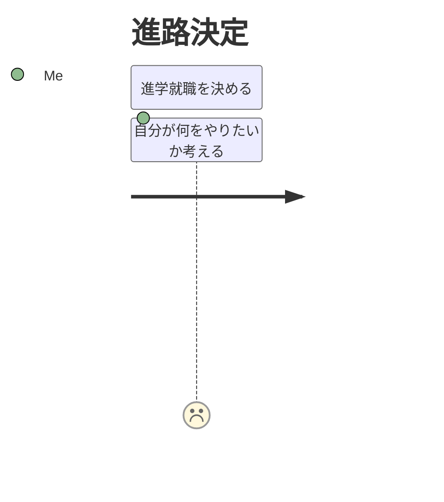

# Task14

## task14-1

SNSがない時点の世界でTwitterを提案するとする。

### なぜあなたはここにいるのか？

#### 大事な理由

- 自分が今感じていることを世界中の人と共有したい
- 同じ趣味を持つ人を探したい
- すでに知り合いである人との交流に使いたい

#### 最大の理由

&rarr; 世界中の人とコミュニケーションを取りたい

### エレベーターピッチ

現在、グローバルでカジュアルなコミュニケーションツールが存在しない。

いわゆる庶民が、無料で世界中とつながることができるツールです。

いつでもどこでも、自分がいま何をしてどう感じているのかを共有でき、それを見た人はそれに対してどう感じたかをフィードバックすることができます。

## task14-2

